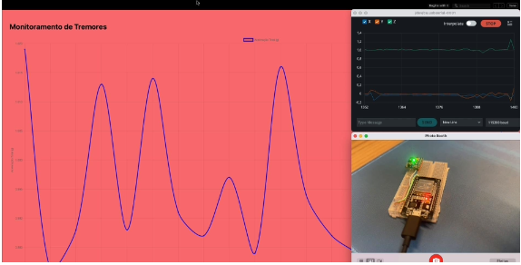

# Projeto de Detecção de Anomalias com Acelerômetro (ESP32 + MPU6050)

Este projeto demonstra uma simulação prática de detecção de anomalias em dados de aceleração coletados de um sensor MPU6050 conectado a um ESP32. O objetivo é identificar variações anômalas de movimento que possam representar eventos relevantes como tremores, quedas ou vibrações inesperadas.

## Componentes Utilizados

- **ESP32** com conectividade Wi-Fi
- **Sensor MPU6050** (acelerômetro + giroscópio)
- **Backend FastAPI**
- **Frontend React para exibição gráfica**
- **Adafruit BMP085** (opcional - sensor de pressão e temperatura)

## Funcionamento

1. O sensor coleta 200 amostras a 200Hz.
2. Os dados são normalizados para valores de aceleração em g.
3. Um POST é feito para o backend via HTTP com os dados em JSON.
4. O backend calcula a aceleração total:  
   \( a_{total} = \sqrt{ax^2 + ay^2 + az^2} \)
5. Se `a_total <= 0.98` ou `>= 1.01`, o ponto é marcado como anomalia.

## Configurações

- **WiFi SSID**: SMS Tecnologia
- **Porta Backend**: 8005
- **Taxa de Amostragem**: 200 Hz
- **Modelo de Detecção**: Threshold estático
- **Linguagens**: Python (FastAPI), C++ (Arduino), JavaScript (React)
- **Ferramentas**: CLion, Arduino IDE, Terminal, Navegador Web

## Execução

### Backend
```bash
uvicorn fastapi_server:app --port 8005 --reload
```

### Frontend
```bash
npm install
npm start
```

### Dispositivo
Upload do código via Arduino IDE para o ESP32.

## Observações

- O projeto foi testado com o sensor parado para medir o ruído base.
- A visualização gráfica apresenta a linha do tempo das leituras e os alarmes são disparados no frontend se a aceleração cruzar os limiares definidos.
- O frontend foi ajustado para suportar diferentes escalas e exibir os dados com clareza.

---

📄 O relatório detalhado com imagens da simulação está disponível no arquivo PDF incluso.

## Repositório

Este projeto está hospedado publicamente no GitHub:

🔗 [https://github.com/alansms/CP02_PHYSICAL_COMPUTING_ROBOTICS_COGNITIVE_IOT](https://github.com/alansms/CP02_PHYSICAL_COMPUTING_ROBOTICS_COGNITIVE_IOT)

Inclui código-fonte completo, datasets utilizados, modelo treinado e o PDF do relatório de entrega.

## Demonstração em Vídeo

📽️ [Clique aqui para assistir à demonstração do projeto](https://drive.google.com/file/d/1mZdYq0PmIcGKYq5ovM_R469sQ2BsSEwu/view?usp=sharing)

[](https://drive.google.com/file/d/1mZdYq0PmIcGKYq5ovM_R469sQ2BsSEwu/view?usp=sharing)

## Manual e Relatório

📘 [Clique aqui para acessar o relatório completo da simulação](relatorio_simulacao_anomalias.pdf)
